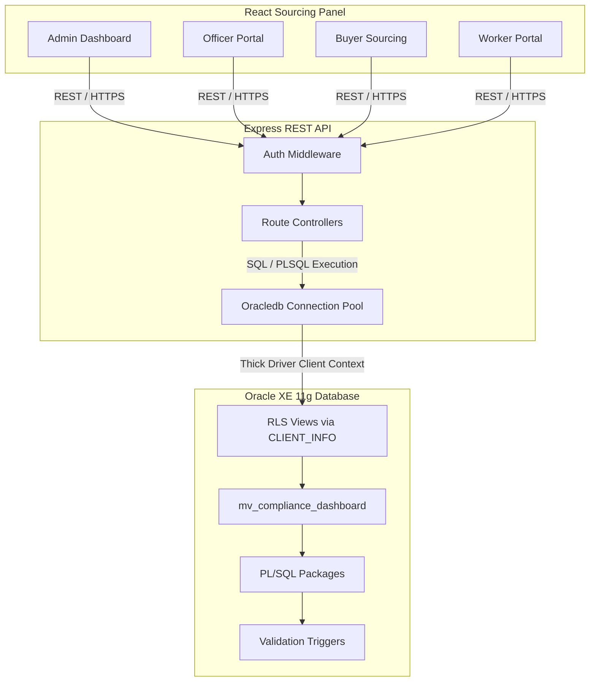

# GarmentGuard 🛡️

A state-of-the-art compliance, health & safety, and worker welfare audit platform designed for Bangladesh's Ready-Made Garment (RMG) sector. 

GarmentGuard coordinates real-time dashboard analytics, role-based access controls, Oracle PL/SQL performance tuning, and automated database triggers to streamline safety compliance tracking across factories.

---

## 🚀 Key Features

* **Real-time Sourcing Metrics**: Factory compliance health checking, audit history tracking, and active certifications monitoring.
* **Granular Role-Based Access Control (RBAC)**: Unique views, database roles, and data segregation for `Admins`, `Compliance Officers`, `Inspectors`, `Buyers`, and `Workers`.
* **Row-Level Security (RLS)**: Transparent row segregation filters (via Oracle `CLIENT_INFO` context maps) protecting worker payroll records and grievance feedback logs.
* **Statutory Compliance Controls**: Automated packages and triggers validating safety equipment expiry, net salaries computation, overtime caps under Bangladesh Labour Law, and factory registration bounds.
* **Polished Visualization Panel**: Comprehensive frontend dashboard tracking audit trends, grievance counts, regional compliance rankings, and recent inspection events.
* **Autonomous Error Logging & Slow Query Monitor**: Automated logging of database errors with transaction isolation and backend slow query performance tracking.

---

## 🛠️ Technology Stack & Prerequisites

* **Database**: Oracle Database 11g (or 21c) Express Edition (XE)
* **Backend**: Node.js v20.x, Express.js, `oracledb` client driver configured in **Thick Mode**
* **Frontend**: React.js, Vite, TailwindCSS (for custom styles), Recharts
* **Authentication**: JSON Web Tokens (JWT) inside `httpOnly` secure cookies
* **API Testing**: Postman Collection (provided at [GarmentGuard.postman_collection.json](file:///e:/GarmentGuard/GarmentGuard.postman_collection.json))

---

## 📐 Architecture Overview

GarmentGuard implements a robust 3-tier architecture with dedicated roles, interfaces, and database-level security policies:



---

## 💾 Database Setup Scripts

The [database/](file:///e:/GarmentGuard/database) directory contains two alternative setup routes. This supports both incremental university-style modular testing and consolidated enterprise deployments:

### 🌟 Path A: Step-by-Step Incremental Build (Recommended)
This pipeline deploys the database schema incrementally, running validations, analytical queries, and RBAC schemas in sequence. Run this pipeline using the master script [deploy.sql](file:///e:/GarmentGuard/database/deploy.sql):

1. **[01_cleanup.sql](file:///e:/GarmentGuard/database/01_cleanup.sql)**: Safely drops existing tables, sequences, packages, and schemas to ensure an idempotent install state.
2. **[02_sequences.sql](file:///e:/GarmentGuard/database/02_sequences.sql)**: Defines Oracle primary key sequence generators (e.g. `FACTORY_SEQ`, `WORKER_SEQ`, `USER_SEQ`).
3. **[03_tables.sql](file:///e:/GarmentGuard/database/03_tables.sql)**: Establishes base tables (`FACTORY`, `BUYER`, `USER_`, `WORKER`, `AUDIT`, `CERTIFICATION`, `SAFETY_EQUIPMENT`, `GRIEVANCE`, `SALARY_RECORD`, `BUYER_FACTORY`, `ERROR_LOG`) alongside before-insert auto-increment triggers.
4. **[04_comments.sql](file:///e:/GarmentGuard/database/04_comments.sql)**: Attaches descriptive dictionary comments to all tables and columns for documentation.
5. **[05_indexes.sql](file:///e:/GarmentGuard/database/05_indexes.sql)**: Deploys composite, unique, and foreign-key performance indexes.
6. **[06_views.sql](file:///e:/GarmentGuard/database/06_views.sql)**: Establishes high-level dashboard query views (e.g. `vw_factory_compliance`).
7. **[07_packages.sql](file:///e:/GarmentGuard/database/07_packages.sql)**: Deploys specs and bodies for the system’s modular business logic packages (`pkg_error_handler`, `pkg_factory_mgmt`, `pkg_worker_mgmt`, and `pkg_reporting`).
8. **[08_functions_triggers.sql](file:///e:/GarmentGuard/database/08_functions_triggers.sql)**: Configures integrity triggers validating statutory overtime boundaries, wage compliance, and safety equipment dates.
9. **[09_seeds.sql](file:///e:/GarmentGuard/database/09_seeds.sql)**: Seeds standard records and bcrypt-hashed passwords.
10. **[10_tests.sql](file:///e:/GarmentGuard/database/10_tests.sql)**: Runs manual business-logic assertion blocks.
11. **[11_verifications.sql](file:///e:/GarmentGuard/database/11_verifications.sql)**: Validates constraints and indexes under load.
12. **[12_production_processing.sql](file:///e:/GarmentGuard/database/12_production_processing.sql)**: Simulates daily factory operations and schedules production batch processing.
13. **[13_test_production_processing.sql](file:///e:/GarmentGuard/database/13_test_production_processing.sql)**: Runs isolated validation testing against transaction handlers.
14. **[14_analytical_queries.sql](file:///e:/GarmentGuard/database/14_analytical_queries.sql)**: Compiles the materialized view `mv_compliance_dashboard` and creates deterministic optimization functions.
15. **[15_rbac_schema.sql](file:///e:/GarmentGuard/database/15_rbac_schema.sql)**: Alters table mappings, sets up application roles (`worker_role`, `buyer_role`, `inspector_role`, `compliance_officer_role`), and constructs RLS Context Views.
16. **[16_seeds_rbac.sql](file:///e:/GarmentGuard/database/16_seeds_rbac.sql)**: Links seeded user entities to database roles.

### 📦 Path B: Consolidated Modular Build
This pipeline deploys a simplified build targeting production schemas using the master installer [install.sql](file:///e:/GarmentGuard/database/install.sql):

* **[01_tables.sql](file:///e:/GarmentGuard/database/01_tables.sql)**: Consolidated table structures and relational keys.
* **[02_sequences.sql](file:///e:/GarmentGuard/database/02_sequences.sql)**: Table sequence triggers.
* **[03_indexes.sql](file:///e:/GarmentGuard/database/03_indexes.sql)**: Secondary relational indices.
* **[04_views.sql](file:///e:/GarmentGuard/database/04_views.sql)**: Base relational database views.
* **[05_packages_spec.sql](file:///e:/GarmentGuard/database/05_packages_spec.sql)**: Delineates PL/SQL package declarations.
* **[06_packages_body.sql](file:///e:/GarmentGuard/database/06_packages_body.sql)**: Houses package operational bodies.
* **[07_triggers.sql](file:///e:/GarmentGuard/database/07_triggers.sql)**: Compiles validation and auto-increment triggers.
* **[08_scheduler_jobs.sql](file:///e:/GarmentGuard/database/08_scheduler_jobs.sql)**: Registers cron batch processes via `DBMS_SCHEDULER`.
* **[09_seed_data.sql](file:///e:/GarmentGuard/database/09_seed_data.sql)**: Inserts user accounts, system configuration thresholds, and sample records.

### 🛠️ Execution Commands

To execute either schema deployment path or clean the database, open a console in the [database/](file:///e:/GarmentGuard/database) directory and run:

1. **Deploy Path A (Step-by-step Incremental)**:
   ```powershell
   sqlplus garmentguard/your_secure_password@localhost:1521/XE "@deploy.sql"
   ```
2. **Deploy Path B (Consolidated Release)**:
   ```powershell
   sqlplus garmentguard/your_secure_password@localhost:1521/XE "@install.sql"
   ```
3. **Rollback / Cleanup**: Drops tables, sequences, roles, views, and scheduled jobs:
   ```powershell
   sqlplus garmentguard/your_secure_password@localhost:1521/XE "@rollback.sql"
   ```
4. **Run Test Suite**:
   ```powershell
   sqlplus garmentguard/your_secure_password@localhost:1521/XE "@test_suite.sql"
   ```

---

## 🏛️ PL/SQL Core Modules

### ⚙️ Packages Overview
GarmentGuard encapsulates complex business requirements in modular, high-performance PL/SQL packages:
* **`pkg_error_handler`**: Implements autonomous transaction error logging. Records runtime backtrace, error code, timestamp, and context username in `ERROR_LOG` without interrupting parent transactions.
* **`pkg_factory_mgmt`**: Manages factory operations:
  * `sp_register_factory`: Enrolls new factories, validating contacts and registration format.
  * `sp_update_compliance_status`: Automatically updates status categories based on audit scores.
  * `sp_schedule_audit`: Registers future audit timelines.
  * `fn_compliance_score`: Employs Oracle `RESULT_CACHE` for fast lookup of factory audit averages.
* **`pkg_worker_mgmt`**: Handles worker administration and regulatory compliance checks:
  * `sp_hire_worker`: Registers new factory employees.
  * `sp_submit_grievance`: Logs worker grievances.
  * `sp_process_salary`: Audits salary calculations (net pay, overtime, and deductions) under the statutory guidelines of the **Bangladesh Labour Act**.
* **`pkg_reporting`**: Compiles reporting cursors:
  * `sp_generate_factory_report`: Outputs structured text reports detailing factory compliance via `DBMS_OUTPUT`.
  * `sp_get_factory_workers` / `sp_get_audit_history`: Returns performance-tuned `SYS_REFCURSOR` references to the Express server.

### 🕒 Automated Scheduler Jobs
Configured in [08_scheduler_jobs.sql](file:///e:/GarmentGuard/database/08_scheduler_jobs.sql) / [08_scheduler_jobs.sql](file:///e:/GarmentGuard/database/08_scheduler_jobs.sql):
* **`job_equipment_alerts`**: Evaluates safety gear logs nightly. Spawns safety alerts for equipment expiring within 30 days.
* **`job_monthly_review`**: Evaluates factory audit freshness monthly, alerting compliance officers of overdue reviews.
* **`job_error_log_purge`**: Purges error records older than 90 days to control tablespace growth.

---

## 📈 Advanced Analytics & Optimization

The platform utilizes advanced Oracle SQL features under [14_analytical_queries.sql](file:///e:/GarmentGuard/database/14_analytical_queries.sql) for complex sourcing and performance analytics:

* **Materialized View (`mv_compliance_dashboard`)**:
  * Caches aggregated factory information (compliance status, open grievance counts, active certifications, and critical equipment status).
  * Automatically refreshes on commits (`REFRESH COMPLETE ON COMMIT`) using deterministic helper functions `fn_get_active_certs`, `fn_get_open_grievances`, and `fn_get_expiring_equip` to guarantee zero-latency response for backend REST requests.
* **Analytical Window Functions**:
  * **Factory Compliance Ranking**: Ranks factories relative to peers within their geographic region:
    ```sql
    RANK() OVER (PARTITION BY district ORDER BY compliance_score DESC)
    ```
  * **Salary Running Totals**: Tracks cumulative net payouts per worker over a fiscal year:
    ```sql
    SUM(net_salary) OVER (PARTITION BY worker_id, year ORDER BY month ROWS UNBOUNDED PRECEDING)
    ```
  * **Audit Trend Deltas**: Uses `LAG()` to contrast historical audits and calculate progress metrics:
    ```sql
    LAG(score) OVER (PARTITION BY factory_id ORDER BY audit_date)
    ```
  * **Multi-Dimensional Aggregations**: Uses `ROLLUP` and `CUBE` grouping functions to dynamically report statistics across districts, compliance levels, and grievance statuses.

---

## 🔑 Database-Level Security & RLS

GarmentGuard secures worker privacy and brand secrets directly at the database layer using **Row-Level Security (RLS)** structures defined in [15_rbac_schema.sql](file:///e:/GarmentGuard/database/15_rbac_schema.sql):

1. **Role-Based Privilege Grants**:
   * `compliance_officer_role`: Full DML permissions across operations (factories, audits, salaries, safety gears).
   * `inspector_role`: Read/Write limits focused on audits, certifications, safety equipment, and read-only grievances.
   * `buyer_role`: Read-only access locked specifically to the factory compliance view, certifications list, and audit score cards.
   * `worker_role`: Select and Insert privileges restricted solely to worker self-service views.
2. **Context-Driven Row Filtering**:
   The database utilizes the `CLIENT_INFO` context attribute mapped within the database session to apply runtime row-level boundaries:
   * **`vw_my_grievances`**: Restricts return data to the logged-in worker's records:
     ```sql
     WHERE worker_id = TO_NUMBER(COALESCE(SYS_CONTEXT('USERENV', 'CLIENT_INFO'), '0'))
     ```
   * **`vw_my_salary_records`**: Protects wage logs by filtering records based on the session's active client ID.

---

## 🌐 Express Backend API Endpoints

### 🔐 Authentication Router ([auth.js](file:///e:/GarmentGuard/backend/src/routes/auth.js) -> `/api/auth`)
* `POST /login`: Validates password hash via bcrypt, signs JWT containing role/scope IDs, and issues an `httpOnly` secure session cookie.
* `GET /me`: Decodes the cookie payload to verify user session state.
* `POST /logout`: Clears the session cookie.

### 🏢 Compliance Officer & Admin Routers
* `/api/dashboard` ([dashboard.js](file:///e:/GarmentGuard/backend/src/routes/dashboard.js) -> `GET`): Fetches aggregated statistics (total factories, compliance breakdown) and updates from the materialized view.
* `/api/analytics/audit-trends` ([analytics.js](file:///e:/GarmentGuard/backend/src/routes/analytics.js) -> `GET`): Returns 12-month compliance trends.
* `/api/factories` ([factories.js](file:///e:/GarmentGuard/backend/src/routes/factories.js) -> `GET`/`POST`): Lists registered factories or registers a new facility.
* `/api/workers` ([workers.js](file:///e:/GarmentGuard/backend/src/routes/workers.js) -> `GET`/`POST`): Manages worker logs and schedules registrations.
* `/api/workers/salary` ([workers.js](file:///e:/GarmentGuard/backend/src/routes/workers.js) -> `POST`): Invokes salary processing blocks.
* `/api/audits` ([audits.js](file:///e:/GarmentGuard/backend/src/routes/audits.js) -> `GET`/`POST`): Registers audit inspections and logs scorecards.
* `/api/reports/factory/:id` ([reports.js](file:///e:/GarmentGuard/backend/src/routes/reports.js) -> `GET`): Compiles a text-based compliance summary report via DBMS_OUTPUT.

### 🌍 Buyer Sourcing Router ([buyer.js](file:///e:/GarmentGuard/backend/src/routes/buyer.js) -> `/api/buyer`)
* `GET /factories/:buyerId`: Returns factories associated with the buyer along with compliance ratings.
* `GET /factory/:factoryId/certifications`: Retrieves a read-only list of active/expired certifications (BSCI, OEKO-TEX, GOTS).

### 🧵 Worker Self-Service Router ([workerPortal.js](file:///e:/GarmentGuard/backend/src/routes/workerPortal.js) -> `/api/worker-portal`)
* `GET /grievances`: Returns the worker's logged grievances via `vw_my_grievances`.
* `POST /grievances`: Submits a safety concern or payroll dispute.
* `GET /salaries`: Fetches the worker's personal pay statements via `vw_my_salary_records`.

---

## 🔑 Seed User Accounts

All seed user accounts use the default password: **`password123`**

| Username | Role | Database Linkages / Details |
| :--- | :--- | :--- |
| `sysadmin` | **Admin** | Unrestricted compliance administrative permissions. |
| `comp_dhaka` | **Compliance_Officer** | Assigned to Factory 1 (Dhaka Garments Ltd). |
| `comp_tongi` | **Compliance_Officer** | Assigned to Factory 3 (Tongi Tex Group). |
| `inspector1` | **Inspector** | Inspection logger; records audit results and scores. |
| `hm_buyer` | **Buyer** | Linked to Buyer 1 (H&M). Sourcing and certifications dashboard access. |
| `worker1` | **Worker** | Linked to Worker 1 (Abul Kalam) at Factory 1. Accesses pay records and submits grievances. |

---

## 🏃 Quick Start Guide

### 1. Database Initialization
Ensure Oracle Database XE (11g or 21c) is installed and active on your local machine. Deploy the database schema using either Path A (incremental build) or Path B (consolidated build) from the SQL*Plus console. For example, to install the incremental build:
```powershell
cd database
sqlplus system/your_system_password@localhost:1521/XE
-- Create the garmentguard user if it does not exist:
CREATE USER garmentguard IDENTIFIED BY password123;
GRANT CONNECT, RESOURCE, CREATE VIEW, CREATE MATERIALIZED VIEW, CREATE ROLE to garmentguard;
GRANT EXECUTE ON DBMS_SCHEDULER TO garmentguard;
EXIT;

-- Run the deploy pipeline:
sqlplus garmentguard/password123@localhost:1521/XE "@deploy.sql"
```

### 2. Configure Backend Services
To connect to the database, the backend uses the `node-oracledb` Thin/Thick client.
1. Navigate to the backend directory:
   ```bash
   cd backend
   npm install
   ```
2. Copy the sample environment file and configure variables:
   ```bash
   cp .env.example .env
   ```
   Modify [backend/.env](file:///e:/GarmentGuard/backend/.env):
   ```env
   PORT=3000
   DB_USER=garmentguard
   DB_PASSWORD=password123
   DB_CONNECTION_STRING=localhost:1521/XE
   JWT_SECRET=your_jwt_secret_key_here
   ```
3. **Oracle Instant Client Setup**:
   The backend initializes the Oracle driver in **Thick Mode** (defined in [pool.js](file:///e:/GarmentGuard/backend/src/db/pool.js#L7-L13)) to support compatibility with Oracle 11g databases:
   * Download the free **Oracle Instant Client** zip from the Oracle website.
   * Extract it to a local directory (e.g. `C:\oracle\instantclient`).
   * Add the path (`C:\oracle\instantclient`) to your operating system's system **`PATH`** environment variable.
4. Launch the backend development server:
   ```bash
   npm run dev
   ```

### 3. Launch Frontend Client
1. Navigate to the frontend directory:
   ```bash
   cd ../frontend
   npm install
   ```
2. Configure the API URL in [frontend/.env](file:///e:/GarmentGuard/frontend/.env):
   ```env
   VITE_API_URL=http://localhost:3000
   ```
3. Run the development server:
   ```bash
   npm run dev
   ```
4. Access the GarmentGuard platform by opening your browser to **`http://localhost:5173`**.

---

## 🧪 Testing & Verification

* **Automated PL/SQL Test Suite**: Runs assertions validating statutory restrictions, autonomous logs, and caching. Execute it from the database folder:
  ```bash
  sqlplus garmentguard/password123@localhost:1521/XE "@test_suite.sql"
  ```
* **Postman Integration**:
  The workspace includes a complete Postman collection containing pre-configured request tests for authentication flow, RBAC verification, RLS validation, and data CRUD operations. Load the collection file [GarmentGuard.postman_collection.json](file:///e:/GarmentGuard/GarmentGuard.postman_collection.json) into Postman to begin testing the endpoints.
